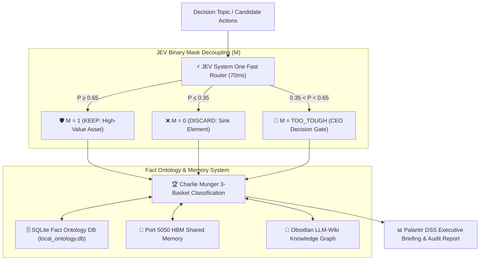

# ⚡ JEV Neurosymbolic Deep Twin Decision Engine (v5.0 World Best)

[](LICENSE)
[](https://www.python.org/)
[](https://typesafe.ai)

> **World-Class AI Decision Engine combining TypeSafe JEV System One (70ms Fast Router), 0-Dependency SQLite Fact Ontology DB, LUCA Binary Mask Decoupling ($M \in \{0, 1, \text{TOO\_TOUGH}\}$), and Charlie Munger 3-Basket Discipline.**

---

## 🌟 Overview

The **JEV Neurosymbolic Deep Twin Decision Engine** is a high-speed, fact-grounded decision support framework designed for complex medical, operational, and financial management challenges. 

Unlike traditional LLMs that suffer from slow latency (1.5s~10s) and generative hallucinations, this engine utilizes **TypeSafe AI's JEV (System One AI)** for ultra-fast (70~200ms) typed probabilistic decisions (`Noul`, `Choice`, `Score`) backed by a zero-dependency local SQLite fact ontology.

---

## 🏛️ Architecture & Decision Loop



---

## ✨ Key Features

1. **⚡ JEV System One Integration (70~200ms Latency)**:
   - **`Noul`**: Boolean statement truthfulness & probability ($P \in [0.0, 1.0]$)
   - **`Choice`**: Categorical classification with confidence distribution
   - **`Score`**: Ordered rubric scoring (e.g. 1~5 score)

2. **🎭 LUCA Binary Mask Decoupling ($M \in \{0, 1, \text{TOO\_TOUGH}\}$)**:
   - **$M = 1$ (Keep)**: Preserves high-ROI value elements
   - **$M = 0$ (Discard)**: Eliminates operational noise
   - **$M = \text{'TOO\_TOUGH'}$ (Ambiguous Zone / CEO Gate)**: Escalates uncertain decisions ($0.35 < P < 0.65$) directly to the CEO for human-in-the-loop approval.

3. **🧺 Charlie Munger 3-Basket Discipline**:
   - `YES Basket` ($M=1$)
   - `NO Basket` ($M=0$)
   - `TOO TOUGH Basket` (Ambiguous -> CEO Approval Gate)

4. **🛡️ 3-Tier Multi-Engine Zero-Downtime Resilience**:
   - Tier 1: TypeSafe Direct API (`https://api.typesafe.ai/v1/systemone`)
   - Tier 2: OpenRouter Decision Gateway (`https://openrouter.ai/api/alpha/decisions`)
   - Tier 3: Local / Gemini 2.5/3.6 Flash Ultra-Fast JSON Fallback Engine

---

## 🚀 Quickstart

### Installation

```bash
git clone https://github.com/sunjongos/jev-neurosymbolic-deeptwin.git
cd jev-neurosymbolic-deeptwin
pip install -r requirements.txt
```

### Python API Usage

```python
from core.neurosymbolic_deeptwin import NeurosymbolicDeepTwinEngine

# Initialize Master Engine
engine = NeurosymbolicDeepTwinEngine()

# Evaluate candidate strategic actions
result = engine.evaluate_decision(
    topic="Hospital Surgical Robot Leasing vs Cash Purchase Strategy",
    candidate_actions=[
        "Phased leasing with performance-based evaluation (Recommended)",
        "Full upfront cash purchase (High Capex Risk)",
        "Postpone acquisition and maintain traditional equipment"
    ]
)

print("Recommended Action:", result["recommended_action"])
print("Charlie Munger Baskets:", result["munger_baskets"])
```

### Run Demo Command

```bash
python examples/demo_hospital_decision.py
```

---

## 📂 Repository Structure

```
jev-neurosymbolic-deeptwin/
├── core/
│   ├── jev_client.py              # JEV System One Client & Smart OpenRouter
│   └── neurosymbolic_deeptwin.py  # Master Neurosymbolic Deep Twin Engine v5.0
├── examples/
│   └── demo_hospital_decision.py  # Hospital Strategic & Emergency Decision Demo
├── .agents/
│   └── skills/
│       └── jev_neurosymbolic_deeptwin/
│           └── SKILL.md           # Antigravity/Luca Agent Skill Specification
├── requirements.txt
├── README.md
└── LICENSE
```

---

## 📜 License

Distributed under the MIT License. See `LICENSE` for more information.
